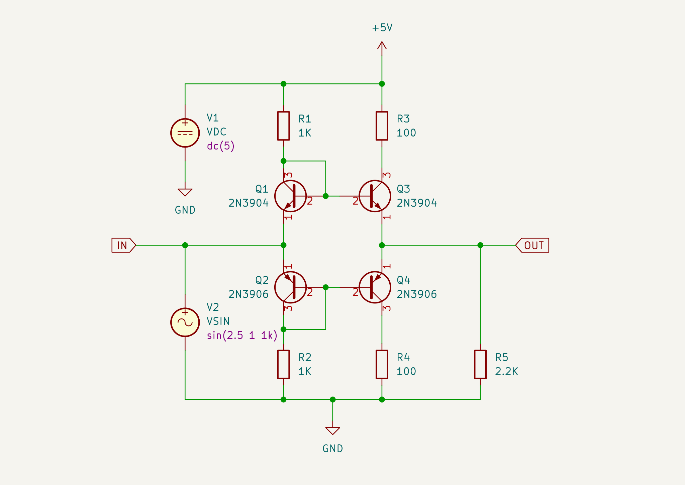
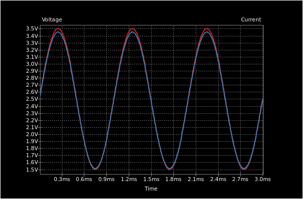

# Push-pull BJT

A push-pull amplifier. The amplifier is a power amplifier, commonly used in
output stages. The voltage gain is 1. The schematic includes SPICE models.

# Usage

Connect a signal generator to `IN`. The input signal should be:

* 1V Vpp
* bias voltage 2.5V
* Frequency 1KHz

See the signal at `OUT`.

## References

* [ADALM2000 Activity: Amplifier Output Stages](https://www.analog.com/en/analog-dialogue/studentzone/studentzone-november-2021.html)
